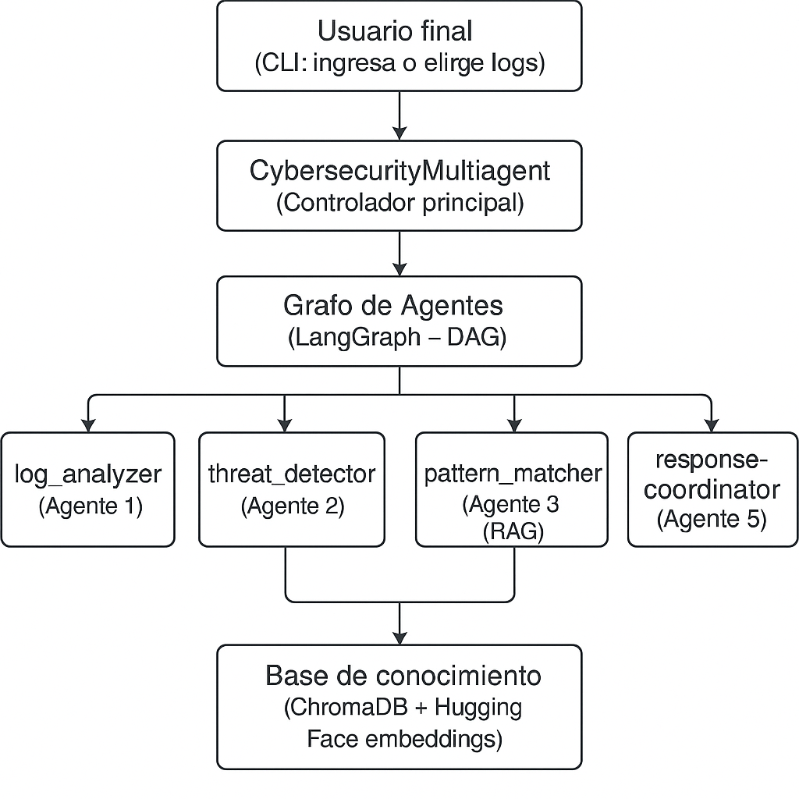
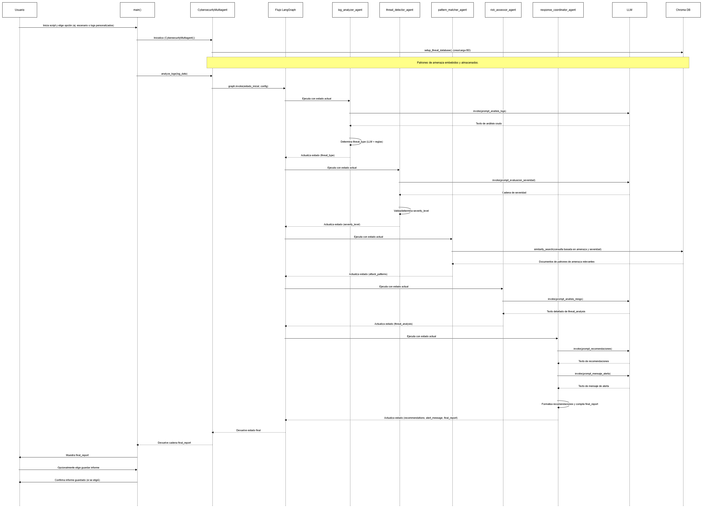

# Propuesta Técnica: Sistema Multiagente de Análisis de Ciberseguridad

## 1. Introducción

Este documento describe la propuesta técnica para un Sistema Multiagente de Análisis de Ciberseguridad. El sistema está diseñado para ingerir registros (logs) de seguridad, analizarlos en busca de amenazas potenciales, evaluar riesgos y generar informes accionables que incluyen alertas y recomendaciones. Emplea una arquitectura multiagente orquestada por LangGraph, utilizando Modelos de Lenguaje Grandes (LLMs) para un análisis sofisticado y un patrón de Generación Aumentada por Recuperación (RAG) para consultar una base de conocimiento de patrones de amenazas.

## 2. Arquitectura del Sistema

El sistema se construye alrededor de una clase central `CybersecurityMultiagent` que gestiona un flujo de trabajo de agentes especializados. Se utiliza LangGraph para definir y ejecutar este flujo de trabajo, asegurando una progresión estructurada y con estado del análisis.

*   **Motor Principal:** `langchain` y `langgraph` para la definición de agentes, gestión de estado y orquestación del flujo de trabajo.
*   **Integración LLM:** Se utiliza `langchain_ollama.OllamaLLM` para interactuar con una instancia de Ollama ejecutándose localmente (modelo: `llama3.2`).
*   **Embeddings:** `langchain_huggingface.HuggingFaceEmbeddings` (modelo: `sentence-transformers/all-MiniLM-L6-v2`) para generar embeddings de texto.
*   **Almacén Vectorial:** `langchain_community.vectorstores.Chroma` para almacenar y consultar embeddings de patrones de amenazas, habilitando RAG.
*   **Gestión de Estado:** Un `SecurityState` TypedDict se utiliza para pasar datos y contexto entre agentes a lo largo de la ejecución del grafo.

## 3. Componentes

### 3.1. Clase `CybersecurityMultiagent`

Esta es la clase principal que orquesta el análisis.
*   **Inicialización (`__init__`)**:
    *   Configura el LLM (`OllamaLLM`).
    *   Inicializa los embeddings (`HuggingFaceEmbeddings`).
    *   Configura la base de datos vectorial de patrones de amenazas (`setup_threat_database`).
    *   Crea el grafo de agentes (`create_agent_graph`).
    *   Genera logs de ejemplo para demostración.
*   **`setup_threat_database()`**:
    *   Define una base de conocimiento de patrones de amenazas de ciberseguridad.
    *   Crea objetos `Document` a partir de estos patrones.
    *   Divide los documentos en fragmentos manejables usando `RecursiveCharacterTextSplitter`.
    *   Crea (o carga si existe) un almacén vectorial `Chroma`, persistiendo en `./threat_db`.
*   **`create_agent_graph()`**:
    *   Define un `StateGraph` con `SecurityState`.
    *   Añade nodos para cada agente especializado.
    *   Define las aristas que representan el flujo de análisis:
        `log_analyzer` -> `threat_detector` -> `pattern_matcher` -> `risk_assessor` -> `response_coordinator` -> `END`.
    *   Compila el grafo con `MemorySaver` para puntos de control (checkpointing).
*   **`analyze_logs(log_data)`**:
    *   Toma datos de logs crudos como entrada.
    *   Inicializa el `SecurityState`.
    *   Invoca el LangGraph compilado con el estado inicial.
    *   Devuelve el `final_report` del estado resultante.

### 3.2. Agentes Especializados (Nodos en el Grafo)

Cada agente es un método dentro de `CybersecurityMultiagent` y realiza una tarea específica interactuando con el LLM y/o el almacén vectorial.

1.  **`log_analyzer_agent(state: SecurityState)`**:
    *   **Propósito**: Parsea y realiza un análisis inicial de los `log_data` de entrada.
    *   **Interacción LLM**: Solicita al LLM que identifique tipos de eventos, actores involucrados y patrones temporales de los logs.
    *   **Lógica**: También usa lógica basada en reglas (coincidencia de cadenas en el contenido del log) para hacer una determinación preliminar de `threat_type`.
    *   **Salida**: Actualiza `state['threat_type']`.

2.  **`threat_detector_agent(state: SecurityState)`**:
    *   **Propósito**: Evalúa la severidad del `threat_type` identificado.
    *   **Interacción LLM**: Solicita al LLM que clasifique la severidad como BAJA, MEDIA, ALTA o CRÍTICA basándose en el tipo de amenaza y fragmentos de logs.
    *   **Lógica**: Incluye lógica de respaldo para asignar severidad basada en mapeos predefinidos si la respuesta del LLM es inválida.
    *   **Salida**: Actualiza `state['severity_level']`.

3.  **`pattern_matcher_agent(state: SecurityState)` (Agente RAG)**:
    *   **Propósito**: Recupera patrones de amenazas conocidos relevantes del almacén vectorial.
    *   **Interacción Almacén Vectorial**: Consulta el almacén vectorial `Chroma` usando el `threat_type` y `severity_level` identificados para encontrar patrones similares (top 3).
    *   **Salida**: Actualiza `state['attack_patterns']` con el contenido de los documentos recuperados.

4.  **`risk_assessor_agent(state: SecurityState)`**:
    *   **Propósito**: Genera un análisis de riesgo detallado.
    *   **Interacción LLM**: Solicita al LLM que proporcione un análisis detallado incluyendo descripción del ataque, impacto potencial, vectores de ataque e IOCs, basándose en `threat_type`, `severity_level` y `attack_patterns`.
    *   **Salida**: Actualiza `state['threat_analysis']`.

5.  **`response_coordinator_agent(state: SecurityState)`**:
    *   **Propósito**: Genera recomendaciones accionables y un mensaje de alerta conciso, luego compila el informe final.
    *   **Interacción LLM**:
        *   Solicita al LLM 3-5 recomendaciones específicas de respuesta (contención, mitigación, recuperación, prevención).
        *   Solicita al LLM que genere un mensaje de alerta conciso.
    *   **Lógica**: Parsea las recomendaciones del LLM. Construye una cadena `final_report` combinando la alerta, el análisis de amenaza, las recomendaciones y los patrones identificados.
    *   **Salida**: Actualiza `state['recommendations']`, `state['alert_message']` y `state['final_report']`.

### 3.3. Flujo de Datos (`SecurityState`)

El `SecurityState` TypedDict actúa como la memoria/contexto compartido que es pasado y actualizado por cada agente en el grafo. Incluye:
*   `log_data`: Los logs de seguridad de entrada.
*   `threat_type`: Tipo de amenaza identificado.
*   `severity_level`: Severidad evaluada.
*   `attack_patterns`: Patrones relevantes de la base de conocimiento.
*   `threat_analysis`: Análisis detallado del evaluador de riesgos.
*   `recommendations`: Pasos de respuesta accionables.
*   `alert_message`: Alerta concisa.
*   `final_report`: El informe textual completo.

## 4. Interfaz de Usuario

El sistema proporciona una interfaz de línea de comandos (CLI) a través de la función `main()`:
*   Muestra un mensaje de bienvenida y una visión general del sistema.
*   Lista escenarios de amenazas predefinidos disponibles (Fuerza Bruta, Inyección SQL, etc.).
*   Solicita al usuario que:
    *   Seleccione un escenario predefinido (1-5).
    *   Ingrese logs personalizados ('c').
    *   Salga ('q').
*   Procesa los logs seleccionados a través del `CybersecurityMultiagent`.
*   Imprime el informe de seguridad final.
*   Ofrece una opción para guardar el informe en un archivo `.txt`.

## 5. Tecnologías Utilizadas

*   **Python 3.x**
*   **Ecosistema Langchain**:
    *   `langchain`
    *   `langgraph`
    *   `langchain_ollama`
    *   `langchain_huggingface`
    *   `langchain_community` (para Chroma)
*   **Ollama** (con modelo `llama3.2`, u otro modelo compatible)
*   **Sentence Transformers** (vía `langchain_huggingface`)
*   **ChromaDB** (vía `langchain_community.vectorstores.Chroma`)
*   Bibliotecas estándar de Python: `os`, `json`, `datetime`, `typing`. (Nota: `pandas` se importa pero no se usa explícitamente en el fragmento proporcionado).

## 6. Diagrama de Interacción

## 7. Conclusión

El Sistema Multiagente de Análisis de Ciberseguridad proporciona un marco robusto para el análisis automatizado de logs de seguridad. Su diseño modular basado en agentes permite la especialización de tareas y la integración de capacidades LLM con la recuperación estructurada de conocimiento. El sistema es extensible y puede mejorarse aún más con agentes más sofisticados, una base de conocimiento más rica y métodos de entrada de datos más diversos.
